/*
* react native 中 art绘图教程
* [ART绘图组件库](https://www.npmjs.com/package/react-native-tcharts)

*/

# React Native ART 绘图教程


## ART介绍
ART是React Native中非常重要的绘图工具。React Native团队分别在0.10.0和0.18.0也添加了iOS和Android平台对ART的支持。
阅读ART源码(路径: node_modules/react-native/Libraries/ART)，入口文件为ReactNativeART.js

## 背景介绍
官方并没有ART相关的API文档，查看网上ART相关的文档及案例：
- [React-Native-ART介绍](https://xgfe.github.io/2017/02/07/TinySymphony/React-Native-ART%E4%BB%8B%E7%BB%8D/)
- [react-native-ART-doc](https://github.com/react-native-china/react-native-ART-doc/blob/master/doc.md)
- [React-Native-ART-Sample](https://github.com/xu-duqing/React-Native-ART-Sample)
- [RN中文社区-ART使用](https://bbs.reactnative.cn/topic/306/%E5%9C%A8react-native%E4%B8%AD%E4%BD%BF%E7%94%A8art/2)

文档对ART的描述都不够具体详细。通过整合各方面文档以及ART的源码，本文旨在提供一份更加完整的ART文档。

## 添加依赖
Android默认是包含ART库，IOS需要单独添加依赖库(ART.xcodeproj)。
1. 右键点击项目 -> ‘Add Files to ProjectName -> 选择 node_modules/react-native/React/Libraries/ART/ART.xcodeproj’
2. 将 libART.a 添加到 Linked Frameworks and Libraries
详细图解可查看： 
[IOS链接ART图解](https://cloud.tencent.com/developer/article/1029586)

## 常用API
ART中常用的API
- [Surface](#Surface)
- [Shape](#Shape)
- [ClippingRectangle](#ClippingRectangle)
- [Text](#Text)
- [LinearGradient](#LinearGradient)
- [RadialGradient](#RadialGradient)
- [Pattern](#Pattern)
- [Transform](#Transform)
- [Path](#Path)
- [Group](#Group)


## 详细介绍各个API使用方法
- ### Surface
相当于提供一个画布区域，可以理解成H5中的`<Canvas>`，以及svg绘图中的`<svg>`标签，所有的绘图相关组件均要包含在该组件中。
#### 支持的props：

| Props |   Type  | Required | Description |
| ----- | --------|--------- | ---------  |
| style |  Object |    No    |Surface样式(暂支持backgroundColor)|
| width |  Number,String |    No    |Surface宽度|
| height|  Number,String |    No    |Surface高度|

#### 代码示例：
```
<Surface width={'300'} height={300} 
        style={{backgroundColor: 'rgba(83, 255, 100, 0.5)'}}>
</Surface>
```


- ### Shape
Shape主要是通过Path来实现绘制矢量图形功能。通过Transform可以对其进行移动、缩放和旋转等操作，进一步实现图形动效。
#### 支持的props
| props | Type | Required | Description |
| ------ | ---- | ------ | ----- |
| fill | String | No | Shape填充色 |
| opacity | Number | No | Shape透明度 |
| stroke | String | No | Path线条颜色 |
| strokeCap | String | No | Path尾部尾部描边样式 oneOf(["butt", "round"(default), "square"]) |
| strokeDash | Object | No | 可以用来绘制虚线, strokeDash([a, b]), 线长-间隔循环| 
| strokeJoin | String | No | 路径连接点样式 oneOf(["miter", "round"(default), "bevel"]) | 
| strokeWidth | String, Number | No |绘图线条宽度 |
| transform | new Transform() | No | 绘图进行transform操作 | 
| d | new Path() | No | Path绘图路径 | 

#### 代码示例：
```
 <Surface width={300} height={300} style={{backgroundColor: '#F6F7F0'}}>
    {/*对比strokeCap*/}
    <Shape 
        d={new Path().moveTo(10, 100).lineTo(100, 100)}
        stroke='#6B6B68'
        strokeWidth={12} //or '12'
        strokeCap='butt'
    />
        <Shape 
        d={new Path().moveTo(10, 150).lineTo(100, 150)}
        //fill='#FFB52E'
        stroke='#6B6B68'
        strokeWidth='12'
        strokeCap='round'
    />
        <Shape 
        d={new Path().moveTo(10, 200).lineTo(100, 200)}
        //fill='#FFB52E'
        stroke='#6B6B68'
        strokeWidth={12}
        strokeCap='square'
    />

    {/*对比strokeJoin*/}
    <Shape 
        d={new Path().moveTo(150, 100).lineTo(250, 120).lineTo(150,140)}
        stroke='#6B6B68'
        strokeWidth={12} 
        strokeJoin='miter'
    />
        <Shape 
        d={new Path().moveTo(150, 150).lineTo(250, 170).lineTo(150,190)}
        //fill='#FFB52E'
        stroke='#6B6B68'
        strokeWidth='12'
        strokeJoin='round'
    />
        <Shape 
        d={new Path().moveTo(150, 200).lineTo(250, 220).lineTo(150,240).close()}
        fill='#BBD6EB'
        stroke='#6B6B68'
        strokeWidth={12}
        strokeJoin='beve'
    />
</Surface>
```
#### 绘制图形
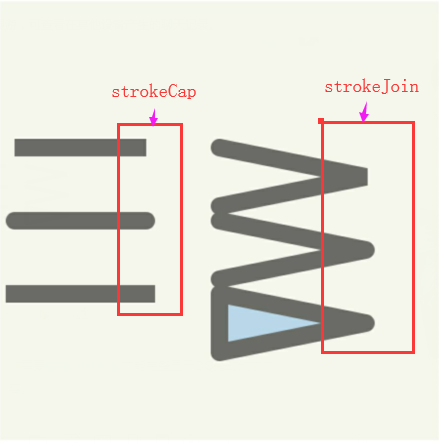

- ### Path
绘制矢量图的路径。
支持方法：
* move() | moveTo()

相同点： 二者皆为移动画笔到某个点重新绘制另一条路径。
不同点： move参数是**相对于前一个点**而言，moveTo参数是画布上相对于(0,0)点。
```
move(x, y) | moveTo(x, y)
x,y分别为横坐标与纵坐标
```
代码示例：

* line() | lineTo()
相同点： 二者皆是开始绘图，画笔绘图到某个点。
不同点： line参数是**相对于前一个点**， lineTo参数是相对于(0,0)点。
```
line(x, y) | lineTo(x, y)
x,y分别为横坐标与纵坐标
```
* arc() |  arcTo()
相同点： 二者均在画布上画圆弧
不同点： arc是相对坐标， arcTo是绝对坐标
```
arc(x, y, rx, ry, outer, counterClockWise, rotation)
arcTo(x, y, rx, ry, outer, counterClockWise, rotation)
```

| Props |   Type  | Required | Description |
| ----- | --------|--------- | ---------  |
| x |  Number |    True   | 横坐标|
| y |  Number |    True   | 纵坐标|
| rx |  Number |    No    |x轴半径 |
| ry |  Number |    No    |y轴半径 |
| outer |  Boolean |    No    | true: 绘制大圆， false: 绘制小圆， 默认false |
| counterClockWise |  Boolean |    No    | true: 逆时针 false: 顺时针 默认false |
| rotation |  String |    No    | 0 or 1 |

其中： 
1. 若是rx < (圆弧终点坐标 - 圆弧起点坐标) / 2, 则绘图会忽略rx直接按照(圆弧终点坐标 - 圆弧起点坐标) / 2的x轴为半径， y轴相同.
2. outer, counterClockWise, rotation若不提供，则默认都为false

* counterArc() | counterArcTo()
功能同arc和arcTo, 逆时针。

* curve() | curveTo()
绘制三阶贝塞尔曲线
```
curve(ControlPoint1.x, ControlPoint1.y, ControlPoint2.x, ControlPoint2.y, deltaX,  deltaY)
介绍： 三阶贝塞尔曲线，
第一个坐标点位: 画笔所在的位置(例如move)，此处定义为（startX, startY）
第二个点坐标为：（startX + deltaX, startY + deltaY）

第一个控制点坐标为： （ControlPoint1.x, ControlPoint1.y）

第二个控制点的坐标为： （ControlPoint2.x, ControlPoint2.y）
```
* reset()
清空绘制路径(可实现画布清空)

* close()
闭合路径(从绘图终点到起点连接)

* toJson()
获得当前路径点，可以用在Shape d属性上
* Path的使用案例


1. 标注1为move moveTo lineTo line对比
```
     <Shape d={new Path()
                .move(50, 50)
                .line(130, 80)
                .move(0, 0)
                .line(30, 60)}
            stroke={'#F76316'}
            strokeWidth={3}
        />
    <Shape d={new Path()
                .move(50, 50)
                .lineTo(130, 80)
                .moveTo(0, 0)
                .lineTo(30, 60)}
            stroke={'#4F18FF'}
            strokeWidth={3}
        />
```
绘制图形：

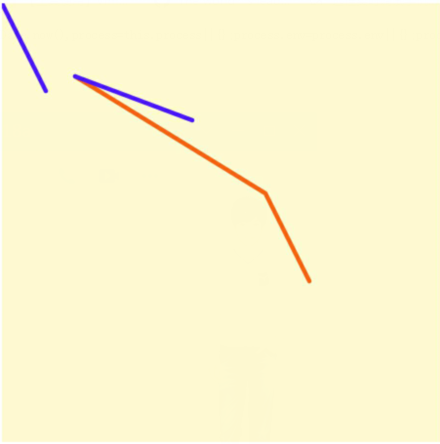

2. 标注为arc，arcTo,及参数选择
```
<Shape d={new Path()
            .moveTo(150, 150)
            .arc(40, 40, 78, 78, true, false, 1)
            } 
        stroke={'#2CE03E'}
        strokeWidth={3}
    />
<Shape d={new Path()
            .moveTo(150, 150)
            .arcTo(40, 40, 78, 78, true, false, 1)
            } 
        stroke={'#5071FF'}
        strokeWidth={3}
    />
<Shape d={new Path()
            .moveTo(150, 150)
            .arcTo(40, 40, 78, 78,false, false, 1)
            } 
        stroke={'#F76316'}
        strokeWidth={3}
    />
<Shape d={new Path()
            .moveTo(150, 150)
            .arcTo(40, 40, 78, 78,false, true, 1)
            } 
        stroke={'#8B33FF'}
        strokeWidth={3}
    />
```
绘制图形：

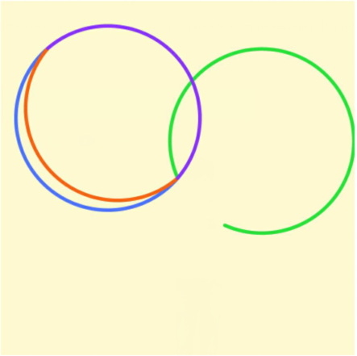

3. 为artTo与 counterArc对比
```
<Shape d={new Path()
        .moveTo(100, 100)
        .counterArcTo(250, 250, 15, 15, true)
        } 
        stroke={'#EB0CB6'}
        strokeWidth={3}
    />
<Shape d={new Path()
    .moveTo(100, 100)
    .arcTo(250, 250, 15, 15, true)
    } 
    stroke={'#3FFA69'}
    strokeWidth={3}
/> 
```
绘制图形：

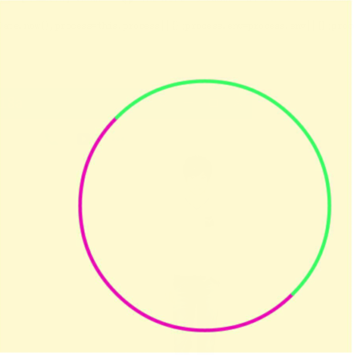

4. 绘制三阶贝塞尔曲线
```
 <Shape d={new Path()
            .move(20, 20)
            .curve(250, 50, 180, 280, 150, 150)
            }
            stroke={'#F76316'}
            strokeWidth={3}
        >
```
绘图:
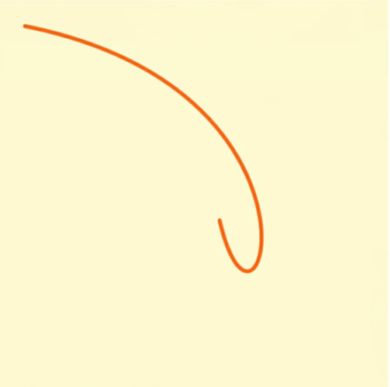

- ### Text
文本组件
#### 支持的props
| Props |   Type  | Required | Description |
| ----- | --------|--------- | ---------  |
| fill |  String |   NO   | 字体填充颜色 |
| opacity |  Number |    NO   | 字体透明度|
| stroke |  Number |    NO   | 字体描边颜色 |
| strokeCap |  Number |   NO    | 同Shape, 亲测效果不明显 |
| strokeDash |  Number |    NO    | 同Shape   |
| strokeJoin |  Number |    NO    | 同Shape, 亲测效果不明显  |
| strokeWidth |  Number |    NO    | 描边宽度 |
| transform |  Number |   NO   | 转换 |
| alignment |  Number |    NO   | 位置oneOf(['center', 'left', 'right']) |
| font | Object or String | NO | 字体相关属性 |
| x | Number | NO | x轴位置 |
| y | Number | NO | y轴位置 |
#### 代码示例
```
<Text 
    //font={`13px "Helvetica Neue", "Helvetica", Arial`}
    font={{
        fontFamily: 'Helvetica Neue, Helvetica, Arial',
        fontSize: 36,
        fontStyle: 'italic',
        fontWeight: 'bold'
    }}
    fill='#3ffa69'
    stroke='#ff00ff'
    strokeWidth={3}
    x={0}
    y={50}
    alignment='left'
    >
    HELLO WORLD
</Text>
<Text 
    //font={`13px "Helvetica Neue", "Helvetica", Arial`}
    font={{
        fontFamily: 'Helvetica Neue, Helvetica, Arial',
        fontSize: 38,
        fontStyle: 'italic',
        fontWeight: 'bold'
    }}
    fill='#3ffa69'
    stroke='#ff00ff'
    strokeWidth={3}
    x={30}
    y={150}
    alignment='left'
    strokeDash={[15, 10]}
    transform={new Transform().rotate(10, 150, 150)}
    >
    ROTATE
</Text>

说明：
strokeDash={[15, 10]}：绘制15像素点长度线条 间隔 10个像素点，依次循环
```
#### 绘制图形
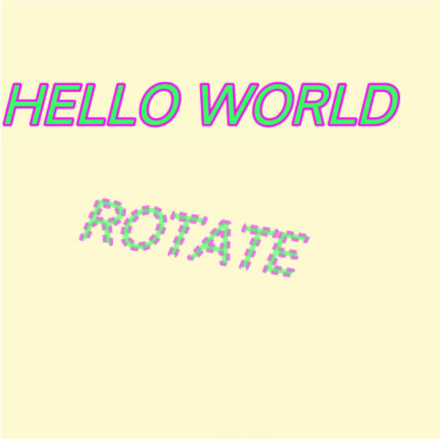

- ### Pattern
图形填充器
#### 支持参数
| 参数 |   Type  | Required | Description |
| ----- | --------|--------- | ---------  |
| url |  String |   YES   | 填充图片url |
| width |  Number |   YES   | 图片宽度 |
| height |  Number |   YES   | 图片高度 |
| left |  Number |   YES   | 图片填充位置 |
| top |  Number |   YES   | 图片填充位置 |
#### 代码示例
```
import resolveAssetSource from 'resolveAssetSource';
const pattern = new Pattern(
    resolveAssetSource(require('../images/dnf4/0-bg.png')), 
    100,100,100,100)
<Shape 
    d={
        new Path()
        .moveTo(0, 0)
        .lineTo(300, 0)
        .lineTo(300, 300)
        .lineTo(0, 300)
        .close()}
    stroke="#000000" 
    strokeWidth={1}
    fill={ pattern } /> 
```
#### 绘制图形
Pattern在安卓上支持不好，会报错误

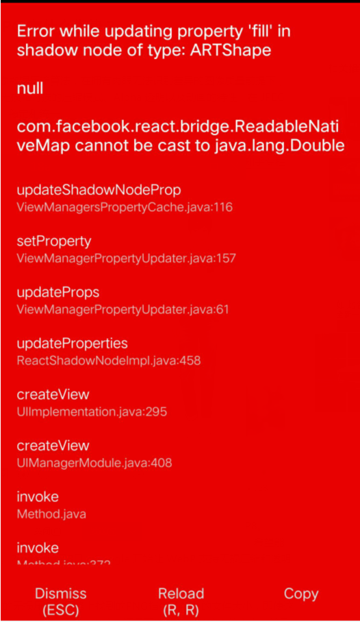

ios绘制图形

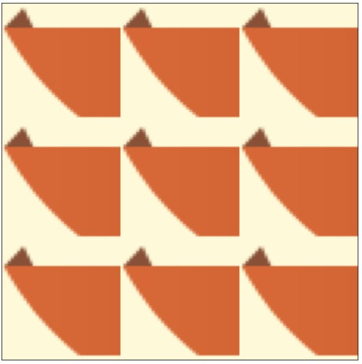
- ### Transform
旋转、缩放、平移等操作
没经过transform变化的图形, 下面绘图示例均是在在该基本图基础上变换。
```
 <Shape 
    d={new Path().moveTo(100, 100)
        .lineTo(200, 100)
        .lineTo(100, 150)
        .close()
    }
    fill='#3ffa69'
    stroke='#ff0000'
    strokeWidth={3}
/>
```
```
1. rotate(deg, x, y) rotateTo(deg, x, y)
deg : 旋转度数
x   : 旋转点横坐标
y   : 旋转点纵坐标
**注意**
若旋转点(x, y)没有传，就默认为Surface的原点(0, 0)
例如： 
new Transform().rotate(20, 30, 30)
new Transform().rotateTo(20, 30, 30)

```
代码示例：
```
<Shape 
    d={new Path().moveTo(100, 100)
        .lineTo(200, 100)
        .lineTo(100, 150)
        .close()
    }
    fill='#3ffa69'
    stroke='#0000ff'
    strokeWidth={3}
    transform={
        new Transform().rotate(180, 150, 150)
    }
/>
```
绘图展示：

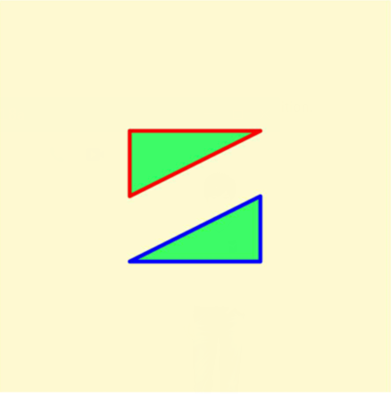
```
2. move(x, y) moveTo(x, y)
x: x轴移动距离
y: y轴移动距离
move相对值，moveTo绝对值

例如： 
new Transform().move(20, 30)
new Transform().moveTo(20, 30)
```
代码示例：
```
<Shape 
    d={new Path().moveTo(100, 100)
        .lineTo(200, 100)
        .lineTo(100, 150)
        .close()
    }
    fill='#3ffa69'
    stroke='#0000ff'
    strokeWidth={3}
    transform={
        new Transform().move(40, 40)
    }
/> 
```
绘图展示：

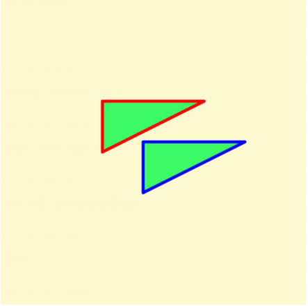

```
3. scale(x, y) scaleTo(x, y)
x: 轴放大倍数
y: y轴放大倍数(NO-required)
**注意**
x，y倍数会对绘制路径上的点坐标做倍数处理，所以会出现位置发生变化。
例如:
new Transform().scale(2, 2)
new Transform().scaleTo(2, 2)
```
代码示例：
```
   <Shape 
        d={new Path().moveTo(100, 100)
            .lineTo(200, 100)
            .lineTo(100, 150)
            .close()
        }
        fill='#3ffa69'
        stroke='#0000ff'
        strokeWidth={3}
        transform={
            new Transform().scale(1.5, 1.5)
        }
    />
```
绘图展示：

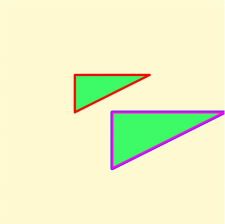

- ### LinearGradient
线性渐变
#### 参数
```
{} 线性渐变 点 对象。 例如：{'0.5': 'blue', 1: 'purple'}
x1, y1: 渐变开始坐标
x2, y2: 渐变结束坐标
```
#### 代码示例
```
 <Shape 
    d={new Path().moveTo(0, 0)
            .lineTo(300, 0)
            .lineTo(300, 300)
            .lineTo(0, 300)
            .close()
        }
    fill={new LinearGradient({
        '0.1': 'rgba(255, 218, 166, 0.8)', 
        '0.25': 'rgba(218, 173, 151, 0.8)',
        '0.5': 'rgba(255, 179, 250, 0.8)',
        '0.8': 'rgba(153, 151, 248, 0.8)',
        '0.99'  : 'rgba(120, 248, 255, 0.8)'
        }, '0', '0', '300', '300')} 
/>
```
#### 绘制图形
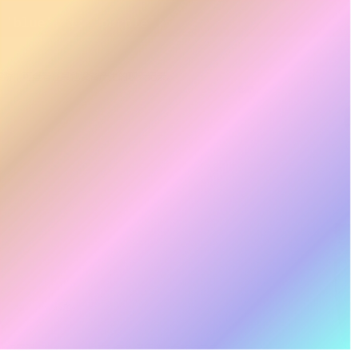

- ### RadialGradient
径向渐变
#### 参数
```
{} 径向渐变 点 对象。 例如：{'0.5': 'blue', 1: 'purple'}
fx, fy: 焦点坐标（决定渐变的中心位置）
rx, ry: 坐标方向半径长度
cx, xy: 原点坐标(以该点位圆心，rx，ry为半径画圆为径向渐变外围)

```
#### 代码示例
```
 <Shape 
    d={new Path().moveTo(0, 0)
            .lineTo(300, 0)
            .lineTo(300, 300)
            .lineTo(0, 300)
            .close()
        }
    fill={new RadialGradient({
        '0.1': 'rgba(255, 218, 166, 0.8)', 
        '0.25': 'rgba(218, 173, 151, 0.8)',
        '0.5': 'rgba(255, 179, 250, 0.8)',
        '0.8': 'rgba(153, 151, 248, 0.8)',
        '0.99'  : 'rgba(120, 248, 255, 0.8)'
        }, '100', '100','150', '150', '150', '150')} 
/>
```
#### 绘制图形
测试部分安卓手机无法支持径向渐变，会呈现黑屏。下图为ios模拟器绘制
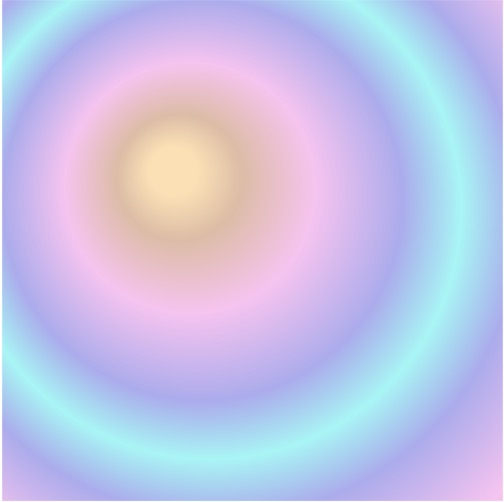

- ### ClippingRectangle
控制图形的显示区域（可以对绘制图片做剪裁）
#### 支持props
| 参数 |   Type  | Required | Description |
| ----- | --------|--------- | ---------  |
| width |  Number |   YES   | 剪裁区域的宽度 |
| height |  Number |   YES   | 剪裁区域的高度 |
| x |  Number |   NO |  剪裁区距离左边距离 |
| y |  Number |   NO   | 剪裁区距离右边距离 |
#### 代码示例
```
<Shape d={ new Path().
    moveTo(100,100)
    .lineTo(100,200)
    .lineTo(250, 150)
    .close()}
    fill={'#0000ff'} 
    stroke="#000" strokeWidth={2}/>
<ClippingRectangle
    width={ 60 }
    height={ 60 }
    x={ 100 }
    y={ 100 }
>
    <Shape d={ new Path().
    moveTo(100,100)
    .lineTo(100,200)
    .lineTo(250, 150)
    .close()}
    fill={'#ff00ff'} 
    stroke="#000" strokeWidth={2}/>
</ClippingRectangle>
```
#### 绘图展示
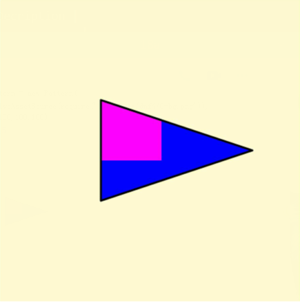
- ### Group
多个图形的组合，可以容纳多个图形以及Group的组合。可以对Group中的图形进行整体的操作。
```
<Group>
    <Shape />
    <Shape />
    <Shape />
    <Group>
    </Group>
</Group>
```